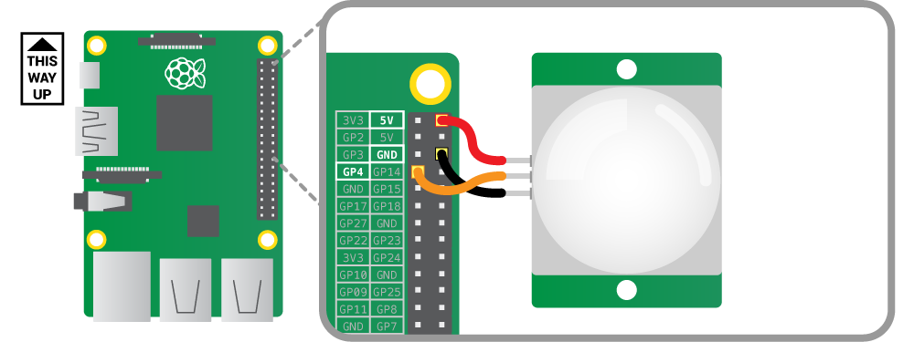

### Connecting a PIR motion sensor

Connect the PIR module before booting your Raspberry Pi.

Gently pop the plastic top off the PIR sensor so that you can see which pin is which. Using three female-to-female jumper cables, connect each of the PIR sensor's connectors to the appropriate pins on the Raspberry Pi as follows:

- Connect the one labelled VCC on the PIR sensor to the 5V pin on the Raspberry Pi. This provides power to the PIR sensor.
- Connect the one labelled GND to a ground pin on the Raspberry Pi. This completes the circuit.
- Connect the one labelled OUT to GPIO pin 4. This pin will output a voltage when motion is detected, the voltage can then be received by the Raspberry Pi.

